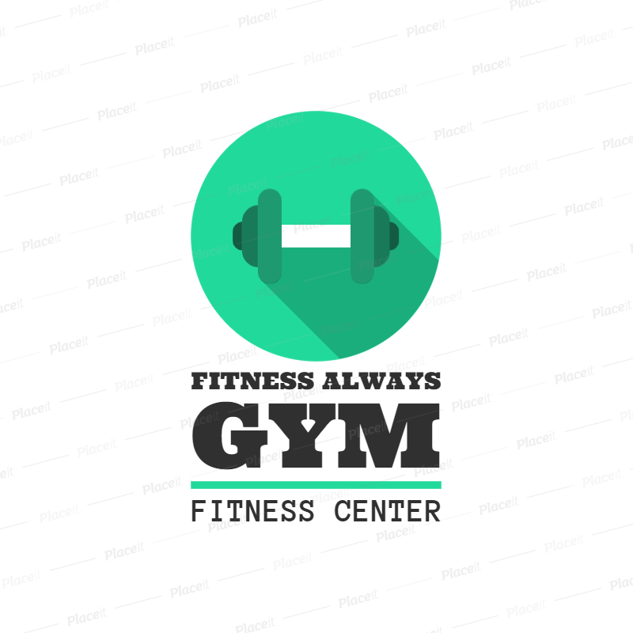

This website is my first milestone project. It is a 
fake website for a GYM named Fitness Always Gym. It is
designed to showcase what I have learnt so far in HTML
and CSS.
This website is made up of 4 pages viz: Home page, 
Facilities page, Gallery page and Contact Us page.
The Home page showcases the front view of the Gym and 
the opening times in addition to the Nav, Header and 
Footer. The Facilities page gave information as 
to available services in addition to the Nav, Header and
Footer. The third page is about the equipment, machines 
and tools available to members for training in pictures. 
This is also in addition to the Nav, Header and Footer.
The Fourth page is where the contact details of the Gym 
can be found. It also shows the Nav, Header and Footer.   